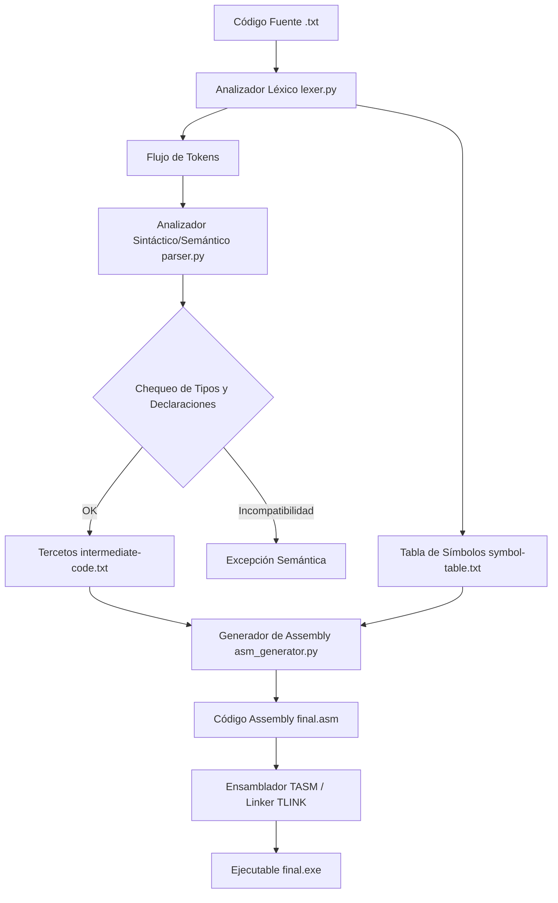

# Guía de Explicación y Defensa del Compilador

Este documento sirve como hoja de ruta completa y mapa mental para la defensa del proyecto del compilador. Detalla la arquitectura del software, las decisiones de diseño, la gramática semántica y cómo se traducen las estructuras a código intermedio (tercetos) y código de máquina (assembly x86 de 16 bits en modo real).

---

## 1. Arquitectura General y Flujo de Ejecución (Mapa Mental)

El compilador sigue una arquitectura de flujo secuencial en etapas (pipeline) clásico de las herramientas de compilación.



### Punto de Inicio y Orquestación
- **Archivo principal**: [lyc-compiler.py](file:///home/dev/Code/lyc2026_grupo02/lyc-compiler.py)
  1. Lee el archivo fuente de entrada (por defecto `resources/test.txt`).
  2. Invoca a `ejecutar_lexer(input_path)` de [lexer.py](file:///home/dev/Code/lyc2026_grupo02/lexer.py). Genera y almacena en la tabla de símbolos los identificadores y literales iniciales.
  3. Invoca a `ejecutar_parser(input_path)` de [parser.py](file:///home/dev/Code/lyc2026_grupo02/parser.py). Valida la sintaxis, corre las reglas semánticas y produce el archivo `intermediate-code.txt`.
  4. Lee la tabla de símbolos final (`symbol-table.txt`) y los tercetos (`intermediate-code.txt`).
  5. Invoca a `generate_asm(tercetos, symbols, output_path)` de [asm_generator.py](file:///home/dev/Code/lyc2026_grupo02/asm_generator.py) para producir el archivo final de assembly [final.asm](file:///home/dev/Code/lyc2026_grupo02/assembler_final/final.asm).

---

## 2. Fase 1: Analizador Léxico (`lexer.py`)

Implementado utilizando la biblioteca **PLY (Lex)**. Lee caracteres secuenciales del código fuente y los agrupa en unidades lógicas llamadas **Tokens**.

### Decisiones de Diseño y Validaciones Críticas:
1. **Límite de Strings (`CTE_STRING`)** (Líneas 95-102):
   - El compilador impone un límite estricto de **50 caracteres** para las constantes string. Si una cadena en el código fuente supera esta longitud, el lexer lanza una excepción léxica interrumpiendo la compilación.
2. **Cotas de Números Enteros (`N_ENTERO`)** (Líneas 123-131):
   - Representados en 16 bits con signo. Rango válido: `[-32768, 32767]`. Valores fuera de rango disparan un error léxico.
3. **Cotas de Números Flotantes (`N_FLOTANTE`) y Corrección de Expresión Regular** (Líneas 108-120):
   - Representados en 32 bits simple precisión (IEEE-754).
   - **Corrección Clave**: La expresión regular original del compilador obligaba a que los números flotantes comenzaran con un dígito distinto de cero (`[1-9]+`). Esto rompía el análisis de números como `0.0`, `0.5`, etc., dividiéndolos erróneamente en dos tokens (un entero `0` y un flotante `.0`). La expresión regular fue reparada a:
     ```python
     r'-?\d+[.]\d*|-?[.]\d+'
     ```
     permitiendo números flotantes válidos que comiencen con cero.

---

## 3. Fase 2: Analizador Sintáctico y Semántico (`parser.py`)

Implementado sobre **PLY (Yacc)**. Construye las reglas gramaticales y ejecuta lógica de validación semántica mediante código embebido en las reglas de reducción de Yacc.

### Gramática y Estructura del Código en Python:

- **Estructura del Programa**:
  - `start : bloque_init programa`
  - `bloque_init` analiza el bloque de inicialización de variables `init { ... }`.
  - `programa` se compone de una secuencia recursiva de `sentencia`.
  - Las sentencias admitidas son asignaciones (`asignacion`), condicionales (`seleccion`), bucles (`ciclo_while` / `ciclo_especial`), escrituras (`salida`), y lecturas (`entrada`).

### Validaciones Semánticas Críticas:
1. **Definición de Variables Duplicadas**:
   - En la regla sintáctica de declaraciones de variables, el compilador verifica si la variable ya fue declarada previamente en la tabla de símbolos. De ser así, se lanza una excepción semántica inmediata.
2. **Validación de Variable No Declarada**:
   - Al parsear variables en expresiones o asignaciones, la función `verificar_variable_declarada(p, var)` consulta el diccionario de tokens de la tabla de símbolos. Si el tipo de la variable no está configurado (por ejemplo, es `"-"`), se arroja un error semántico.
3. **Chequeo Estricto de Tipos en Asignaciones (`p_asignacion`)** (Líneas 182-199):
   - **Corrección Clave**: Originalmente, el compilador solo arrojaba error si se intentaba asignar algo no-string a una variable de tipo `String`.
   - Modificamos la regla para obligar a que **ambos lados de la asignación tengan exactamente el mismo tipo** (Float a Float, Int a Int, String a String), arrojando excepciones descriptivas ante incompatibilidades léxico-semánticas.
4. **Chequeo Estricto de Tipos en Comparaciones (`p_condicion_simple`)** (Líneas 318-326):
   - **Corrección Clave**: Se propagó el tipo del operando izquierdo a través de `p_condicion_simple_expi` y se validó en `p_condicion_simple` que coincida exactamente con el tipo del operando derecho. Si se intenta evaluar, por ejemplo, `Int > Float`, el compilador ahora arroja un error semántico.

---

## 4. Fase 3: Generación de Código Intermedio (Tercetos)

La representación intermedia se guarda en `intermediate-code.txt`. Utiliza una estructura de tripletas / tercetos de tres campos: `(operador, operando1, operando2)`.

### Relación entre Estructuras Sintácticas y Tercetos:
- Las expresiones aritméticas se reducen a tercetos encadenados mediante índices entre corchetes (ej. `[15]`).
- **Manejo del Ciclo `While`**:
  ```mermaid
  stateDiagram-v2
      L_Inicio_Condicion: Condicion CMP
      L_Salto_Condicional: Branch condicional si es Falso
      L_Cuerpo: Ejecuta sentencias
      L_Salto_Incondicional: JMP a L_Inicio_Condicion
      
      [*] --> L_Inicio_Condicion
      L_Inicio_Condicion --> L_Salto_Condicional
      L_Salto_Condicional --> L_Cuerpo : Verdadero
      L_Cuerpo --> L_Salto_Incondicional
      L_Salto_Incondicional --> L_Inicio_Condicion
      L_Salto_Condicional --> [*] : Falso (Sale del bucle)
  ```
  - En `parser.py`, al toparse con un `WHILE` (`p_comienzo_ciclo_while`), se almacena su índice en la pila `indice_etiqueta_ciclo_while`.
  - La condición genera un `CMP` y un salto condicional (por ejemplo, `BGE` si la comparación lógica es menor). El índice de este salto condicional se guarda en `indice_comienzo_ciclo_while`.
  - Al cerrar la llave del cuerpo del `while` (`p_ciclo_while`), el compilador crea un salto incondicional (`BI` o Branch Inconditional) apuntando al índice del inicio de la condición guardado en la pila. Finalmente, modifica el terceto de salto condicional guardado en `indice_comienzo_ciclo_while` para que apunte al final del bucle (el índice actual + 1).

---

## 5. Caso de Estudio Paso a Paso: `while var in [lista] do`

Esta estructura de control especial itera sobre una lista de valores estáticos e incrementa un contador implícito en cada paso.

### Código de Prueba de Entrada:
```c
while a in [10, 20, 30] do
    write(a)
endwhile
```

### Paso 1: Procesamiento en `parser.py` (Líneas 434-487)
1. Al leer `while a in`, la variable del bucle `a` se guarda en `variable_ciclo_while_especial`.
2. Al procesar la lista `[10, 20, 30]`, se crea un identificador auxiliar temporal en la tabla de símbolos (por ejemplo, `@aux1`), que servirá como contador de iteraciones indexadas, inicializándose en `0`.
3. Se genera la condición de parada: compara `@aux1` con el largo de la lista (en este caso, `3`). Si `@aux1 >= 3` (`BGE`), salta fuera del ciclo especial.
4. Para cada elemento en la lista, se genera un terceto de comparación indexado:
   - Compara `@aux1` con el índice del elemento (por ejemplo, `CMP(@aux1, 0)`).
   - Genera un salto condicional `BE` (Branch if Equal) que apunta a la asignación del valor del elemento correspondiente a la variable `a` (`a := 10`).
5. En cada iteración de la gramática, al final del cuerpo del bucle:
   - Se incrementa el contador auxiliar: `@aux1 := @aux1 + 1`.
   - Se realiza un salto incondicional (`BI`) al inicio de la condición de parada del ciclo.

### Paso 2: Representación en Tercetos (`intermediate-code.txt`)
La compilación sintáctica de la estructura genera los siguientes tercetos numerados:
```text
[50] := (@aux1, 0)          ; Inicializa contador auxiliar
[51] CMP (@aux1, 3)         ; Compara índice con límite de lista (3 elementos)
[52] BGE [63]               ; Si índice >= 3, salta al final del bucle (terceto 63)
[53] CMP (@aux1, 0)         ; ¿Estamos en la primera iteración?
[54] BE [57]                ; Si sí, salta a la asignación del primer elemento (terceto 57)
[55] CMP (@aux1, 1)         ; ¿Estamos en la segunda iteración?
...
[57] := (a, 10)             ; Asigna el valor correspondiente del elemento
...
[60] WRITE a                ; Cuerpo del bucle
[61] + (@aux1, 1)           ; Incremento de índice auxiliar
[62] BI [51]                ; Salto incondicional al inicio del ciclo
[63] ...                    ; Siguiente sentencia del programa (fin del bucle)
```

### Paso 3: Traducción en Assembly (`asm_generator.py`)
1. El contador auxiliar `@aux1` se declara en la sección `.DATA` como variable de doble palabra: `@aux1 dd ?`.
2. El salto condicional `BGE` se traduce en assembly a un salto condicional real (ej. `jge L63`).
3. El salto condicional `BE` se traduce a la instrucción `je` (Jump if Equal).
4. El incremento se traduce a código assembly aritmético estándar:
   ```assembly
   mov eax, @aux1
   add eax, 1
   mov @aux1, eax
   ```
5. El salto `BI` genera `jmp L51`.

---

## 6. Fase 4: Generación de Assembler (`asm_generator.py`)

Esta fase transforma secuencialmente el flujo de tercetos intermedios en código ensamblador compatible con **TASM** (16-bit real mode / 32-bit registers con la directiva `.386`).

### Correcciones Críticas de Diseño:

> [!IMPORTANT]
> **1. Corrección del error "Illegal Immediate" de TASM**
> El compilador original generaba la instrucción `lea esi, OFFSET STR_X` o `lea edi, OFFSET variable`. En arquitectura x86 de 16 bits real mode, `OFFSET` se calcula como una constante/inmediata en tiempo de compilación. Puesto que `LEA` calcula dinámicamente direcciones de memoria reales de punteros direccionados, compilar `LEA reg, inmediato` es ilegal.
> **Solución**: Reemplazamos estas instrucciones en el generador por cargas directas mediante `mov`:
> ```assembly
> mov si, OFFSET STR_X
> mov di, OFFSET variable
> ```

> [!TIP]
> **2. Corrección del Salto de Ciclo Especial (`BE`)**
> En la tabla de mapeo de saltos condicionales `COND_MAP`, el operador `BE` (Branch if Equal) estaba ausente. Esto causaba que al generar assembly para las condiciones de asignación de ciclos especiales, la instrucción de salto condicional se ignorara. Como consecuencia, el flujo del programa siempre caía a la asignación del primer elemento, arrojando valores incorrectos (imprimiendo los mismos elementos repetidas veces).
> **Solución**: Agregamos la equivalencia `'BE': 'je'` a `COND_MAP`.

### Integración de Punto Flotante y Coprocesador FPU:
Originalmente, el compilador procesaba variables y literales de tipo `Float` usando instrucciones enteras de CPU (`add`, `imul`, `idiv`). Esto producía cálculos e impresiones erróneas porque sumaba y multiplicaba representaciones binarias IEEE-754 como si fuesen números enteros de dos complementos.

Para solucionar esto, implementamos soporte completo de FPU/x87 en `asm_generator.py`:

1. **Aritmética Float Nativa (FPU)**:
   Si los tipos de los operandos que participan de una expresión (`+`, `-`, `*`, `/`) son detectados como `Float` mediante la rutina `get_operand_type`, se generan instrucciones FPU nativas de 32 bits:
   - **`fld dword ptr [op1]`**: Carga el float en la pila de registros de la FPU.
   - **`fadd / fsub / fmul / fdiv dword ptr [op2]`**: Realiza el cálculo matemático flotante en la FPU.
   - **`fstp dword ptr [dest]`**: Almacena el resultado flotante calculado en la variable de destino y desapila.

2. **Comparaciones de Floats Seguras (FPU)**:
   Al traducir el terceto `CMP` de variables flotantes, el generador utiliza la FPU para comparar los registros de manera precisa, transfiriendo las banderas mediante las instrucciones:
   - **`fcomp dword ptr [op]`**: Compara los floats.
   - **`fstsw ax`**: Transfiere el registro de banderas de la FPU a `ax`.
   - **`sahf`**: Carga el registro de banderas del procesador desde `ah`.

3. **Mapeo Dinámico de Jumps para Floats**:
   Puesto que la comparación FPU configura las banderas sin signo del CPU, los saltos condicionales con signo (`jle`, `jge`, `jl`, `jg`) se remapean dinámicamente a sus equivalentes sin signo correspondientes:
   - `jl` (Jump if Less) $\rightarrow$ **`jb`** (Jump if Below).
   - `jg` (Jump if Greater) $\rightarrow$ **`ja`** (Jump if Above).
   - `jle` (Jump if Less/Equal) $\rightarrow$ **`jbe`** (Jump if Below/Equal).
   - `jge` (Jump if Greater/Equal) $\rightarrow$ **`jae`** (Jump if Above/Equal).

4. **Entrada/Salida con macros especializadas**:
   El generador de assembly verifica el tipo de la variable involucrada en las instrucciones `WRITE` y `READ`. Si es de tipo `Float`, llama a las macros **`DisplayFloat`** y **`GetFloat`** (de `number.asm`), en lugar de `DisplayInteger` y `GetInteger`.

---

## 7. Preguntas Frecuentes para la Defensa

### Q: ¿Por qué usas variables auxiliares como `@aux1` en el ciclo especial?
**A**: Para mantener un registro indexado de cuántas iteraciones se han realizado sobre la lista. Esto permite implementar de forma genérica bucles que operan sobre listas de expresiones estáticas sin necesidad de un contador que sea visible o modificable por el programador dentro del cuerpo del ciclo.

### Q: ¿Cómo se entera el ensamblador si una expresión es de tipo Float o Int en tiempo de generación de código?
**A**: En `asm_generator.py` implementamos la función `get_operand_type`, que consulta la tabla de símbolos y rastrea de manera ordenada los tipos de las expresiones en cada terceto (`tmp_types`). Si alguno de los operandos participantes es flotante, la operación entera se promociona a flotante y se resuelven las instrucciones adecuadas.

### Q: ¿Qué hace `finit` al principio del assembly?
**A**: Limpia e inicializa el estado del coprocesador de punto flotante (FPU). Garantiza que la pila de registros de punto flotante de la FPU esté vacía antes de realizar operaciones de precisión aritmética.
