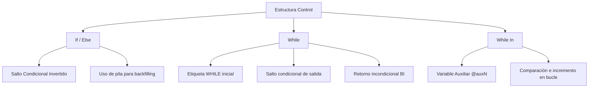

# Explicación Profunda de las Decisiones de Diseño del Compilador

Este documento detalla las decisiones estratégicas de diseño y la lógica detrás de la traducción de tokens, control de flujo, verificación de tipos y generación de código ensamblador (TASM) tomadas en este compilador.

---

## 1. Tabla de Símbolos y Estrategia de Tokens (`i_token.py` y `lexer.py`)

La gestión de los tokens y constantes en el compilador sigue reglas estrictas para facilitar las etapas posteriores (análisis sintáctico, semántico y generación de código):

| Tipo de Token | Expresión Regular | Límites / Validaciones | Estrategia de Almacenamiento en Tabla de Símbolos |
| :--- | :--- | :--- | :--- |
| **Identificadores (Variables)** | `[a-zA-Z](\w\|_)*` | Máximo 20 caracteres. | Se almacenan con su nombre real (ej: `miVariable`). Tipo de dato asignado en la sección `init`. |
| **Constantes Enteras** | `0\|-?[1-9]\d*` | Enteros de 16 bits con signo: $[-32768, 32767]$. | Prefijo de guión bajo (ej: `_10`, `_n5`). Tipo: `cte_int`. |
| **Constantes Flotantes** | `-?\d+[.]\d*\|-?[.]\d+` | Flotantes de 32 bits con signo: $[-3.4e38, 3.4e38]$. | Prefijo de guión bajo con reemplazo de punto (ej: `_3_14`, `_n0_5`). Tipo: `cte_float`. |
| **Constantes de Texto** | `\"[^"]*\"` | Máximo 50 caracteres (sin contar comillas). | Prefijo de guión bajo + valor limpio de comillas (ej: `_hola_mundo`). Tipo: `cte_str`. |

### Racionales de diseño:
* **El prefijo de guión bajo (`_`):** Es una estrategia clásica para evitar colisiones de nombres en el código ensamblador generado. Previene que una constante con valor `123` o `hola` coincida con una etiqueta interna de la arquitectura o una palabra reservada de TASM.
* **Sanitización de números negativos y decimales:** En ensamblador, los caracteres `-` y `.` no son válidos en nombres de etiquetas. Por ende, en la generación de código se convierten los signos negativos a `n` y los puntos a `_` (ej. `-2.5` se traduce a `_n2_5`).

---

## 2. Decisiones de Control de Flujo (`parser.py`)

El flujo de control del programa se traduce a una representación intermedia de **tercetos**. Cada estructura de control maneja su lógica de saltos utilizando técnicas de **backfilling** (relleno diferido de direcciones de salto).



### A. Estructuras de Selección (`if` / `else`)
1. **Lógica Invertida de Comparación:** Cuando se evalúa una condición, el compilador genera un salto condicional que se activa si la condición es **falsa** (para esquivar el cuerpo del `if`).
   * Ejemplo: Para `a >= b`, el compilador genera un terceto de comparación `CMP` y luego un salto `BLT` (Branch if Less Than / Salto si es menor).
2. **Uso de la Pila para Direcciones:** Como el destino del salto fuera del bloque no se conoce hasta terminar de compilar el cuerpo del `if`, se apila el índice del salto en `indice_comienzo_seleccion`.
3. **Backfilling:** Al completarse el cuerpo, se desapila el índice de la instrucción de salto y se modifica para apuntar a la dirección actual (`terceto.get_indice()`).
4. **Tratamiento del `else`:** 
   * Si existe un bloque `else`, al final del cuerpo del `if` se debe insertar un salto incondicional `BI` (Branch Inconditional) para no ejecutar las instrucciones del `else` al terminar el `if`.
   * El salto condicional original del `if` se redirecciona para que apunte al inicio del bloque `else` (justo después del `BI`).
   * El `BI` se resuelve al finalizar el bloque `else` redirigiéndolo al final de toda la selección.

### B. Ciclos Condicionales (`while`)
1. **Etiqueta de Retorno:** Se coloca una etiqueta de inicio `WHILE` antes de la condición del ciclo. Su índice se guarda en `indice_etiqueta_ciclo_while`.
2. **Salto de Salida:** Se genera la condición de la misma manera que en el `if` (con lógica invertida de salto), guardando la dirección del salto condicional en `indice_comienzo_ciclo_while`.
3. **Bucle Finito:** Al finalizar el cuerpo del loop, se crea un salto incondicional `BI` apuntando a la etiqueta de retorno guardada en el paso 1.
4. **Resolución de Salida:** El salto condicional de salida se modifica para que apunte al terceto inmediatamente posterior al `BI` final.

### C. Ciclo Especial (`while in`)
La sintaxis es: `while VARIABLE in [ exp1, exp2, ... ] do programa endwhile`.

Para evitar soporte complejo de listas en tiempo de ejecución, el compilador transforma esta estructura a nivel de tercetos en un ciclo equivalente gobernado por un índice de iteración entero.

* **Paso a Paso de la Estrategia:**
  1. Se crea una variable auxiliar con un nombre único: `@auxN`.
  2. Se inicializa `@auxN` en `0` (el índice de la primera expresión).
  3. Se genera un ciclo condicional estándar (`WHILE`).
  4. La condición del ciclo compara `@auxN` con el número total de expresiones en la lista. Si es mayor o igual (`BGE`), salta fuera del ciclo.
  5. Para cada expresión en la lista, se genera una comparación: si `@auxN` es igual a `i` (donde `0 <= i < len`), se realiza la asignación `VARIABLE := exp[i]`, y luego se salta incondicionalmente (`BI`) al cuerpo del ciclo.
  6. Al final de la iteración, se incrementa la variable de control: `@auxN := @auxN + 1`.
  7. Se retorna al inicio del ciclo mediante un salto incondicional `BI`.
* **Validación Semántica:** Se realiza una verificación de tipos rigurosa. Cada una de las expresiones dentro del corchete debe coincidir exactamente con el tipo de datos de la variable de control `VARIABLE`.

### D. Conectores Lógicos (`AND`, `OR`, `NOT`)
El compilador realiza cortocircuito para optimizar la ejecución:
* **NOT:** En lugar de evaluar y negar con lógica booleana costosa, simplemente se invierte el operador del salto condicional (usando `diccionarioComparadoresNot`).
* **AND:** Cortocircuito estricto. Si la primera comparación es falsa, se salta directamente al final de la estructura (o al bloque `else`). Solo si es verdadera, se pasa a evaluar la segunda condición.
* **OR:** Cortocircuito optimizado. Si la primera condición es verdadera, se realiza un salto directamente al inicio del cuerpo de la estructura. Si es falsa, se procede a evaluar la segunda condición.

---

## 3. Estrategia de Operaciones y Tipos Semánticos (`parser.py`)

El sistema de tipos del compilador asegura la coherencia y robustez matemática:

* **Asignaciones:** Coincidencia estricta. No se permite asignar un tipo `Int` a `Float` ni viceversa. Las cadenas solo admiten otras cadenas.
* **Comparaciones:** Deben ser entre tipos de datos idénticos (ej. no se puede comparar una variable `Float` con una `Int` sin previa conversión).
* **Operaciones Aritméticas (`+`, `-`, `*`, `/`, `DIV`, `MOD`):**
  * Los operadores comunes (`+`, `-`, `*`, `/`) validan que ambos operandos sean numéricos (`Int` o `Float`).
  - **Aritmética Mixta (Promoción):** Si se opera un `Int` con un `Float`, el compilador promociona automáticamente el tipo resultante a `Float` (propagación hacia arriba).
  - **División Real (`/`):** El resultado final siempre se promociona a tipo `Float`.
  - **División Entera (`DIV`) y Resto (`MOD`):** Operaciones restringidas estrictamente a enteros (`Int`). Lanza una excepción semántica si se intenta operar con flotantes.

---

## 4. Generación de Código Ensamblador (`asm_generator.py`)

La generación de código objeto se enfoca en arquitectura x86 de 16 bits en sintaxis TASM, utilizando registros extendidos de 32 bits (disponibles desde la arquitectura `.386`) para facilitar la aritmética y FPU.

### A. Estructura de Datos en Ensamblador
* **Enteros (`Int`) y Flotantes (`Float`):** Se declaran como variables de 32 bits usando `dd` (double word). Esto simplifica el uso conjunto de la FPU (Coprocesador Matemático) y registros de 32 bits (`EAX`, `EBX`, etc.).
* **Cadenas (`String`):** Se guardan como arrays de bytes terminados con el carácter `$` (específico de DOS): `db 51 dup(?), "$"` para ser impresos de forma nativa por la Interrupción 21h (Servicio 09h).
* **Variables Temporales:** Cada terceto aritmético (`+`, `-`, etc.) genera un temporal `tmp{idx} dd ?` en la sección `.DATA`.

### B. Aritmética de Enteros vs Flotantes
* **Aritmética de Enteros:** Se realiza usando registros generales del CPU (`EAX`, `EBX`, `EDX`).
  * Para multiplicar: se utiliza `imul eax, right`.
  * Para dividir o módulo entero (`DIV` y `MOD`): se realiza una extensión de signo sobre `EDX:EAX` usando `cdq` y se llama a `idiv ebx`. El cociente queda en `EAX` (`DIV`) y el residuo en `EDX` (`MOD`).
* **Aritmética de Flotantes (Coprocesador x87):**
  * Se inicializa la FPU con `finit`.
  * Los operandos se apilan en el coprocesador con `fld dword ptr [op]`.
  * Se ejecutan operaciones de FPU (`fadd`, `fsub`, `fmul`, `fdiv`).
  * Se desapila el resultado y se almacena en memoria con `fstp dword ptr [dest]`.

### C. Lógica de Comparación y Saltos Condicionales
La comparación difiere drásticamente según el tipo de datos:

1. **Comparación Entera:**
   ```assembly
   mov eax, izquierda
   cmp eax, derecha
   jl/jg/je/jne/jge/jle ...  ; Saltos condicionales estándar con signo
   ```
2. **Comparación Flotante (FPU):**
   Dado que los flags del coprocesador x87 no están conectados de forma directa al registro de flags del CPU, se requiere un puente de instrucciones:
   ```assembly
   fld dword ptr [izquierda]
   fcomp dword ptr [derecha]  ; Compara y saca el elemento de la pila
   fstsw ax                   ; Copia el registro de estado de la FPU en AX
   sahf                       ; Transfiere AH a los flags del CPU (SF, ZF, AF, PF, CF)
   jb/ja/je/jne/jae/jbe ...   ; Saltos condicionales sin signo (unsigned)
   ```
   > [!IMPORTANT]
   > Al transferir los flags de la FPU al CPU mediante `sahf`, los códigos de condición se mapean a los flags de acarreo y cero (CF y ZF). Por lo tanto, el compilador debe mapear los saltos firmados tradicionales (`jg`, `jl`, `jge`, `jle`) a sus equivalentes sin signo correspondientes (`ja`, `jb`, `jae`, `jbe`).

### D. Manipulación de Cadenas
Las cadenas en ensamblador no admiten asignaciones directas de registros. El compilador implementa un bucle de copia a nivel de bytes:
```assembly
    mov si, OFFSET fuente
    mov di, OFFSET destino
    cld
copy_string_{idx}:
    lodsb
    stosb
    cmp al, '$'
    jne copy_string_{idx}
```
Esto asegura que las cadenas se copien carácter por carácter en memoria hasta el terminador de fin de cadena `$`.
